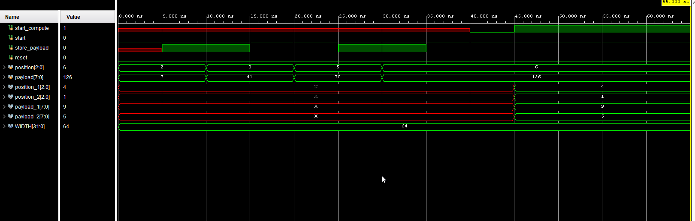

"# reed-solomon-verilog" 
"# reed-solomon-verilog" 
# Reed solomon encoder - decoder
### Assuming a 6 chunk ( 1 byte sized ) data transfer
2 chunks are redundant encoded data, and this code does the job of generating them.
The other 4 chunks are the original data.

## The simulation outputs
The inputs are given by keeping in mind to test it on FPGA (Artyx - 7), sequentially each chunk is stored and then the computation starts.

At this point only the coordinates 1,2,3,4 were given with their payloads.
- It finds the dropped chunk positions, which are 5, 6 here.
- The respective payloads are 70, and 126

So the whole data was (1,5), (2,7), (3, 41), (4, 9), [redundant - (5,70),(6,126)]

Let us suppose the chunks 1 and 4 get dropped, which were a part of original data, as there are 2 redundant chunks, we can recover 2 chunks of lost data at max.

so the leftover sequence is this (2,7), (3, 41), [redundant - (5,70),(6,126)]

As we can see, it successfully recovered the chunks 1, and 4.
